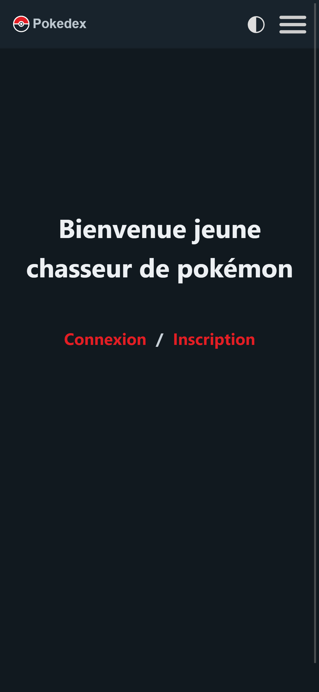
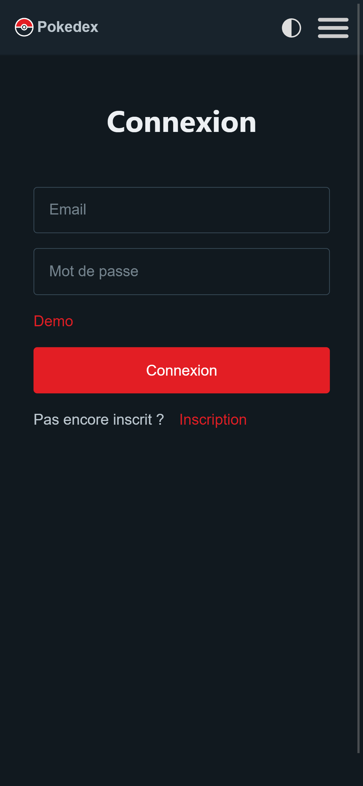
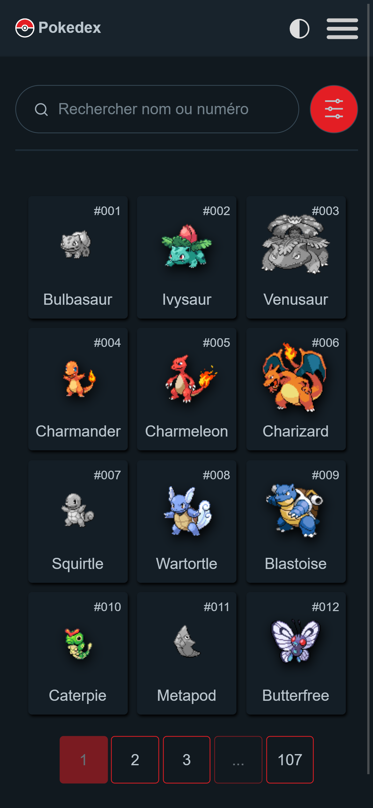
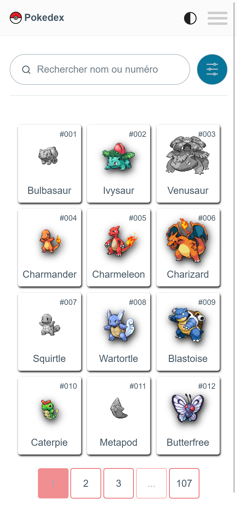
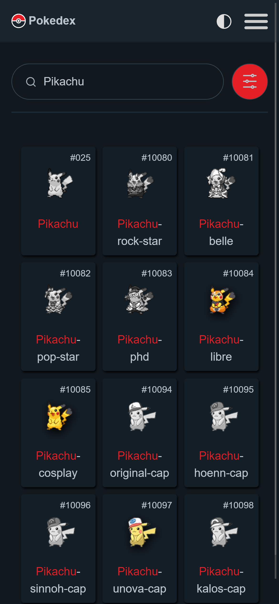
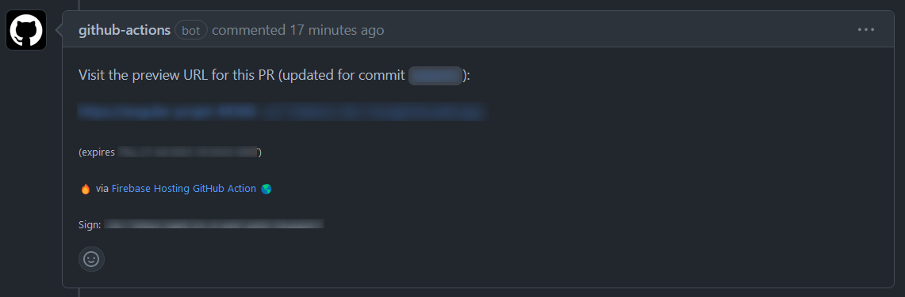

# Pokedex

## Demo

https://angular-projet-44368.web.app

## Description

Le pokedex possède différentes fonctionnalités tel que: 
- login et de register avec firebase
- système de recherche et de filtre de pokemon
- enregistrement de vos pokemon capturé (pokemon couleurs si capturé)
- affichage des détails d'un pokemon

## Screenshots








## Installation

Cloner le projet et lancer la commande suivante:

```bash
npm install
```

## Utilisation

```bash
npm run start:dev
```

## Pull Request

Lors d'une pull request une demo est mis en place sur firebase hosting. La git action va écrir un commentaire sur la pull request avec le lien de la demo.



